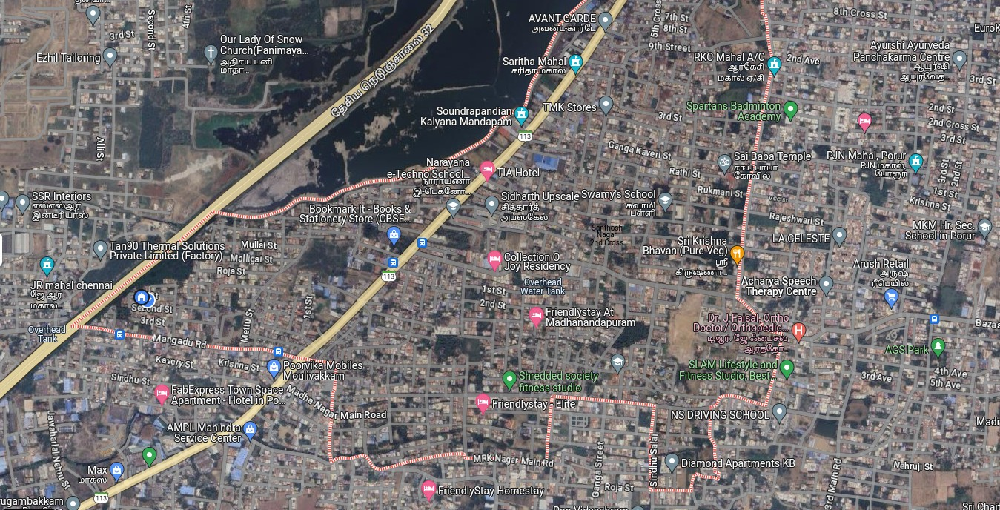
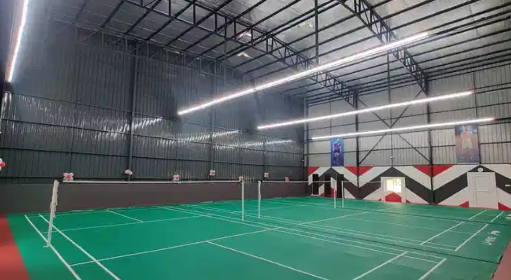
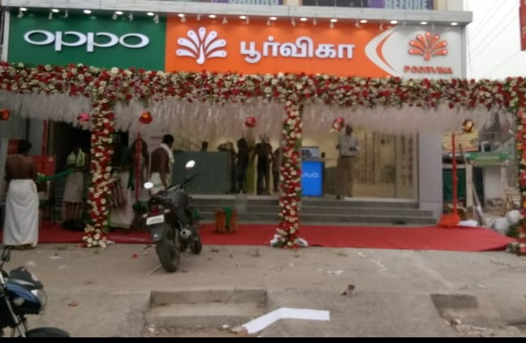
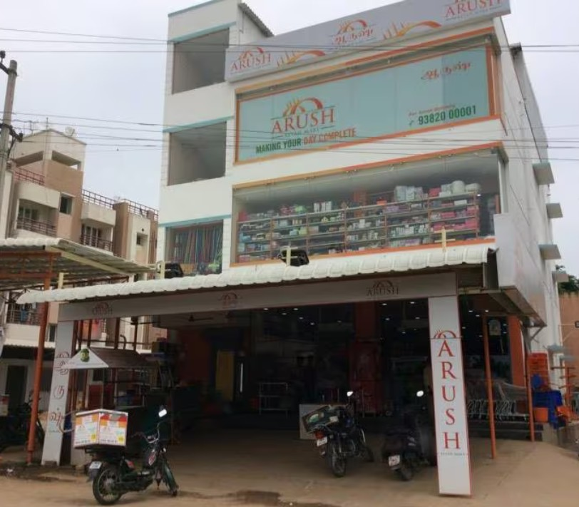

# Places Around Me
## AIM:
To develop a website to display details about the places around my house.

## Design Steps:

### Step 1:
Clone the repoitory
### Step 2:
Add html files in static folder. Run the python file.
## Code:
### Map:
```html
<!DOCTYPE html>
<html>
    <head>
        <title>
            Imagemaps Demo
        </title>
    </head>
    <style>
        body{
            margin-left: 285px;
            background-color: bisque;
        }
        h1{
            margin-left: 35%;
        }
    </style>
    <body>
        <h1>Image maps</h1>
        
        <map name="image_map"
        <area alt="Clothing store" title="Clothing store" href="dress.html" coords="141,639,201,672" shape="rect">
        <area alt="Super Market" title="Super Market" href="smarket.html" coords="1190,400,1222,431" shape="rect">
        <area alt="Mobile Store" title="Mobile Store" href="mobstore.html" coords="357,505,389,531" shape="rect">
        <area alt="Badminton Court" title="Badminton Court" href="bcourt.html" coords="1053,152,1086,181" shape="rect">
        <area alt="School" title="School" href="school.html" coords="884,279,915,302" shape="rect">
        </map>
    </body>
</html>
```
### Badminton court:
```html
<!DOCTYPE html>
<html>
    <title>
        Badminton court
    </title>
    <head>
        <style>
        body{
            margin-left: 400px;
            background-color: rgb(102, 182, 119);
        }
        h1{
            margin-left: 25%;
        }
    </style>
        <body>
            <h1>Badminton court</h1>
             
        </body>
    </head>
</html>
```
### Clothing store:
```html
<!DOCTYPE html>
<html>
    <title>Clothing store</title>
<head>
    <style>
        body{
            margin-left: 550px;
            background-color: rgb(184, 81, 73);
        }
        h1{
            margin-left: 18%;
        }
    </style>
    <body>
        <h1>Clothing Store</h1>
         
    </body>
</head>
</html>
```
### Mobile store:
```html
<!DOCTYPE html>
<html>
    <title>
      Mobile store
    </title>
    <head>
        <style>
            body{
                margin-left: 600px;
                background-color: rgb(105, 102, 182);
            }
            h1{
                margin-left: 15%;
            }
        </style>
        <body>
            <h1>Mobile Store</h1>
             
        </body>
    </head>
</html>
```
### Super market:
```html
<!DOCTYPE html>
<html>
    <title>
        Super Market
    </title>
    <head>
        <style>       
        body{
            margin-left: 500px;
            background-color: rgb(184, 167, 73);
        }
        h1{
            margin-left: 20%;
        }
    </style>
 
        <body>
            <h1>Super market</h1>
             
        </body>
    </head>
</html>
```
## Output:


## Result:

The program is sucessfully executed.